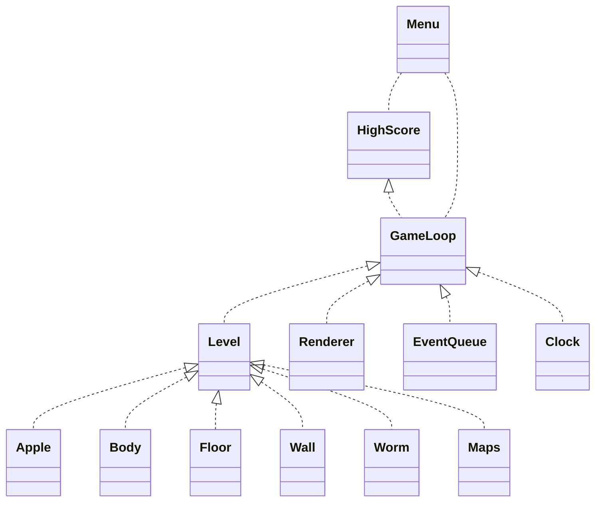
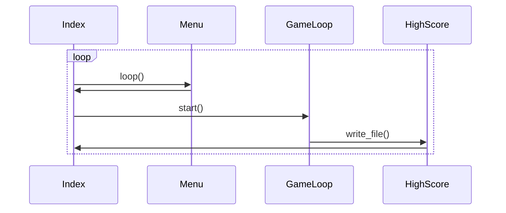

### Sovellusarkkitehtuuri

```mermaid
classDiagram
    GameLoop <|.. Level
    GameLoop <|.. Renderer
    GameLoop <|.. EventQueue
    GameLoop <|.. Clock
    HighScore <|.. GameLoop
    Level <|.. Apple
    Level <|.. Body
    Level <|.. Floor
    Level <|.. Wall
    Level <|.. Worm
    Level <|.. Maps
    Menu .. GameLoop
    Menu .. HighScore
```

### Sekvenssikaavio, joka kuvaa ohjelman käynnistämistä, pelin aloittamista ja palaamista päävalikkoon

```mermaid
sequenceDiagram
    participant Index
    participant Menu
    participant GameLoop
    participant HighScore
    loop
    Index->>Menu: loop()
    Menu->>Index: 
    Index->>GameLoop: start()
    GameLoop->>HighScore: write_file()
    HighScore->>Index: 
    end
```
