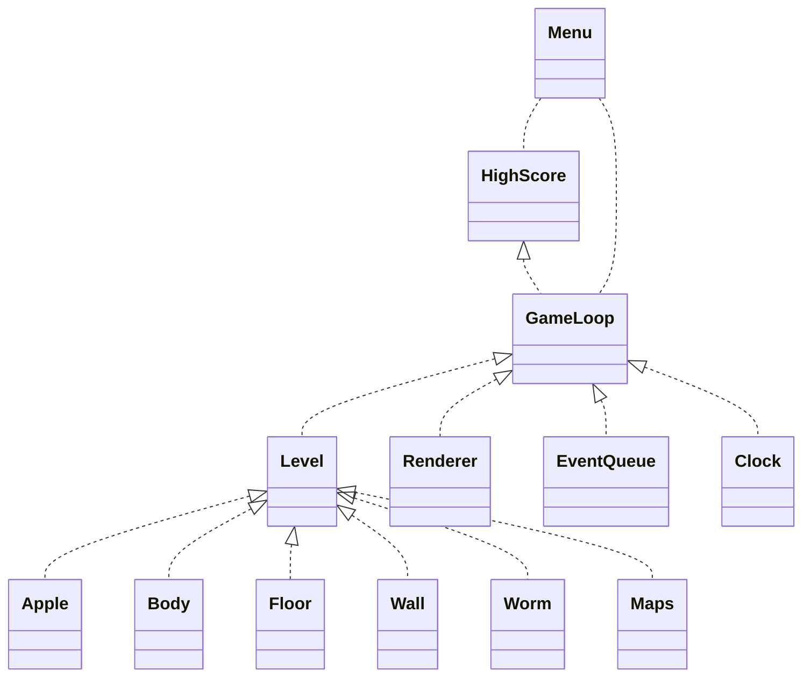
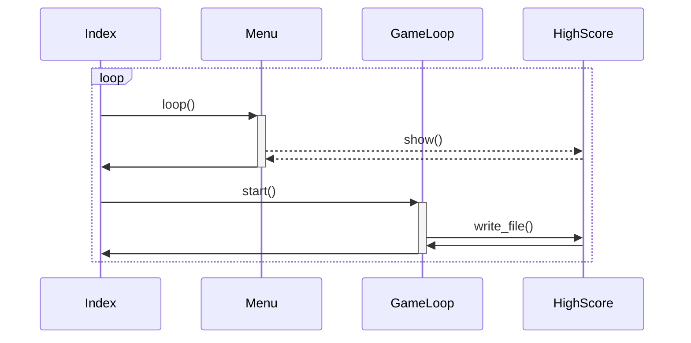
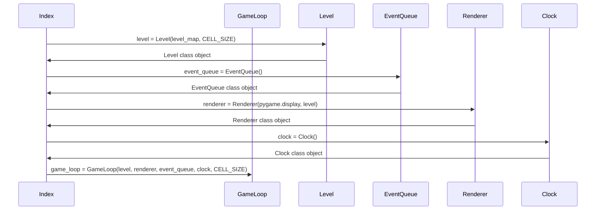

### Sovellusarkkitehtuuri

### Ohjelman suoritus pähkinänkuoressa

Peli käynnistyy päävalikkoon kutsumalla Menu-luokan konstruktoria ja funktiota Menu.loop(). Päävalikossa käyttäjä voi valita haluamansa toiminnon
käyttäen nuolinäppäimiä ja enter-painiketta. Valitsemalla keskimmäisen eli "High score", sovellus alustaa parhaat tulokset Highscore-luokan oliona
ja piirtää ne ruudulle kutsumalla funktiota Highscore.show(). Mikäli käyttäjä valitsee alimman vaihtoehdon, sovellus keskeyttää itsensä käyttäen
Pythonin exit()-funktiota.

Käyttäjän valitessa päävalikon ylimmän vaihtoehdon eli "New game", sovellus poistuu silmukasta Menu.loop() ja alustaa pelisilmukan tarvitsemat luokat.
Lopulta se kutsuu GameLoop-luokan konstruktoria ja sen jälkeen aloittaa silmukan kutsuen funktiota GameLoop.start().

GameLoop.start()-funktiossa oleva silmukka tarkkailee Level-luokan funktion Level.update() palauttamaa boolean-arvoa eli käytännössä tilannetta,
jossa mato törmää joko seinään tai itseensä. Se tallentaa tämän tiedon muuttujaan collision. Mikäli collision == True, silmukka kutsuu Highscore-luokan
funktiota Highscore.write_file() verratakseen pelaajan tulosta aiempiin ennätystuloksiin.

Highscore.write_file()-funktio lisää pelaajan tuloksen listaan, johon on aiemmin GameLoop-luokan konstruktorissa luettu aiemmat ennätystulokset. Tämän
jälkeen se järjestää listan käänteisenä aloittaen isoimmasta tuloksesta ja tallentaa viisi parasta annettuun tekstitiedostoon. Funktiokutsun jälkeen
GameLoop.start() rikkoo silmukkansa ja palaa näin takaisin pääohjelmaan, mikä aloittaa suorituksen alusta.

#### Sama sekvenssikaaviona

### GameLoop-luokan rakentaminen

Päävalikon ja ennätystulosten ulkopuolella suurin osa sovelluksen toiminnoista on rakennettu GameLoop-luokan alaisuuteen. Tämä vuorostaan koostuu
useista alaluokista, jotka konstruoidaan kuitenkin jo ennen GameLoop-luokkaa ja lähetetään tämän konstruktorille parametreina. Toiminnallisuus
on periytynyt sovelluksen inspiraationa ja pohjana käytetystä [Sokoban-pelistä](https://github.com/ohjelmistotekniikka-hy/pygame-sokoban). Voisi
kuitenkin olla jatkossa järkevää siirtää tämä toiminnallisuus suoraan osaksi GameLoop-luokan konstruktoria sovelluksen myöhemmissä versioissa.

