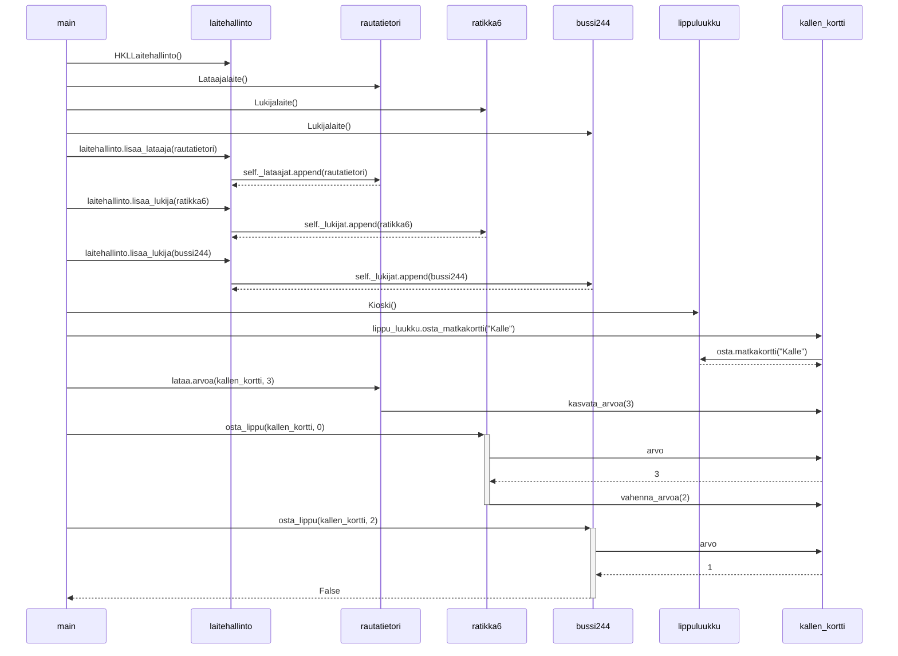

### Tehtävä 4: Laajempi sekvenssikaavio

```mermaid
sequenceDiagram
    participant main
    participant laitehallinto
    participant rautatietori
    participant ratikka6
    participant bussi244
    participant lippuluukku
    participant kallen_kortti
    main->>laitehallinto: HKLLaitehallinto()
    main->>rautatietori: Lataajalaite()
    main->>ratikka6: Lukijalaite()
    main->>bussi244: Lukijalaite()
    main->>laitehallinto: laitehallinto.lisaa_lataaja(rautatietori)
    laitehallinto->>rautatietori: self._lataajat.append(rautatietori)
    rautatietori-->>laitehallinto: 
    main->>laitehallinto: laitehallinto.lisaa_lukija(ratikka6)
    laitehallinto->>ratikka6: self._lukijat.append(ratikka6)
    ratikka6-->>laitehallinto: 
    main->>laitehallinto: laitehallinto.lisaa_lukija(bussi244)
    laitehallinto->>bussi244: self._lukijat.append(bussi244)
    bussi244-->>laitehallinto: 
    main->>lippuluukku: Kioski()
    main->>kallen_kortti: lippu_luukku.osta_matkakortti("Kalle")
    kallen_kortti->>lippuluukku: osta.matkakortti("Kalle")
    lippuluukku-->>kallen_kortti: 
    main->>rautatietori: lataa.arvoa(kallen_kortti, 3)
    rautatietori->>kallen_kortti: kasvata_arvoa(3)
    main->>+ratikka6: osta_lippu(kallen_kortti, 0)
    ratikka6->>kallen_kortti: arvo
    kallen_kortti-->>ratikka6: 3
    ratikka6->>-kallen_kortti: vahenna_arvoa(2)
    main->>+bussi244: osta_lippu(kallen_kortti, 2)
    bussi244->>kallen_kortti: arvo
    kallen_kortti-->>bussi244: 1
    bussi244-->>-main: False
```
