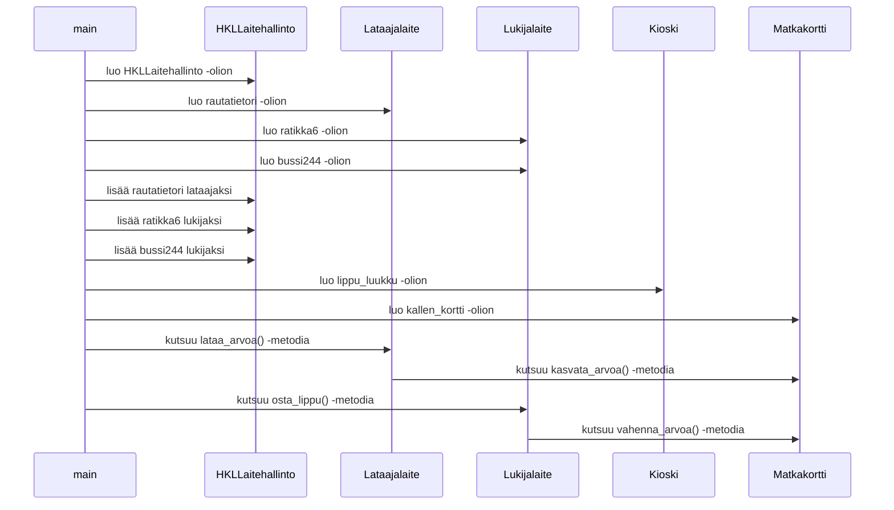

### Tehtävä 4: Laajempi sekvenssikaavio

Tämän version teki ChatGPT syötteenä tehtävän 4 tehtävänanto kokonaisuudessaan.

```mermaid
sequenceDiagram
    participant main
    participant HKLLaitehallinto
    participant Lataajalaite
    participant Lukijalaite
    participant Kioski
    participant Matkakortti
    
    main->>HKLLaitehallinto: luo HKLLaitehallinto -olion
    main->>Lataajalaite: luo rautatietori -olion
    main->>Lukijalaite: luo ratikka6 -olion
    main->>Lukijalaite: luo bussi244 -olion
    main->>HKLLaitehallinto: lisää rautatietori lataajaksi
    main->>HKLLaitehallinto: lisää ratikka6 lukijaksi
    main->>HKLLaitehallinto: lisää bussi244 lukijaksi
    main->>Kioski: luo lippu_luukku -olion
    main->>Matkakortti: luo kallen_kortti -olion
    main->>Lataajalaite: kutsuu lataa_arvoa() -metodia
    Lataajalaite->>Matkakortti: kutsuu kasvata_arvoa() -metodia
    main->>Lukijalaite: kutsuu osta_lippu() -metodia
    Lukijalaite->>Matkakortti: kutsuu vahenna_arvoa() -metodia
```
