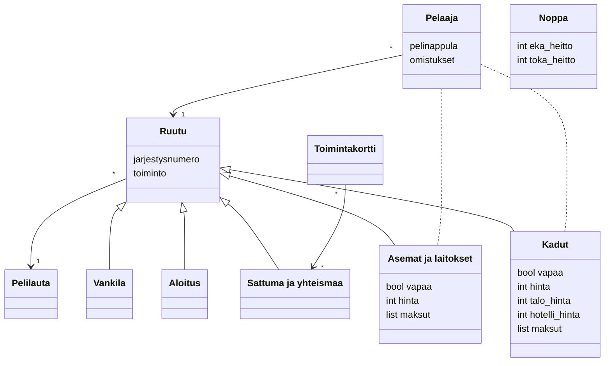

### Monopoli luokkakaaviona

```mermaid
classDiagram

%% Alustetaan luokat ja niiden suhteet
    Ruutu "*" --> "1" Pelilauta
    Pelaaja "*" --> "1" Ruutu
    Ruutu <|-- Vankila
    Ruutu <|-- Aloitus
    Ruutu <|-- `Sattuma ja yhteismaa`
    Ruutu <|-- `Asemat ja laitokset`
    Ruutu <|-- Kadut
    Toimintakortti "*" --> "*" `Sattuma ja yhteismaa`
    Pelaaja .. Kadut
    Pelaaja .. `Asemat ja laitokset`

%% Määritetään yläluokkien ominaisuudet
    class Pelilauta{
    }
    class Ruutu{
        jarjestysnumero
        toiminto
    }
    class Pelaaja{
        pelinappula
        omistukset
    }
    class Noppa{
        int eka_heitto
        int toka_heitto
    }

%% Määritetään perittyjen luokkien ominaisuudet
    class `Asemat ja laitokset`{
        bool vapaa
        int hinta
        list maksut
    }
    class `Kadut`{
        bool vapaa
        int hinta
        int talo_hinta
        int hotelli_hinta
        list maksut
    }
```    
