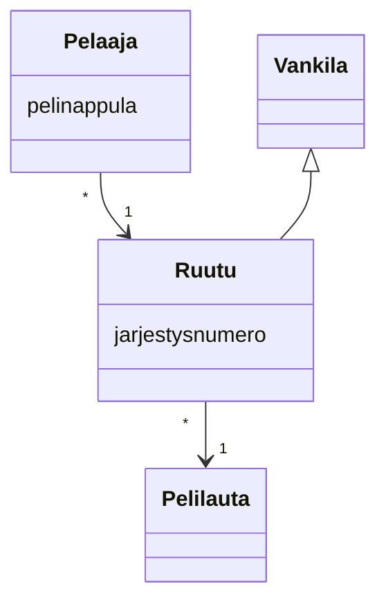

### Monopoli luokkakaaviona

```mermaid
classDiagram

%% Alustetaan luokat ja niiden suhteet
    Ruutu "*" --> "1" Pelilauta
    Pelaaja "*" --> "1" Ruutu
    Vankila <|-- Ruutu

%% Määritetään luokkien ominaisuudet
    class Pelilauta{
    }
    class Ruutu{
        jarjestysnumero
    }
    class Pelaaja{
        pelinappula
    }
```    
