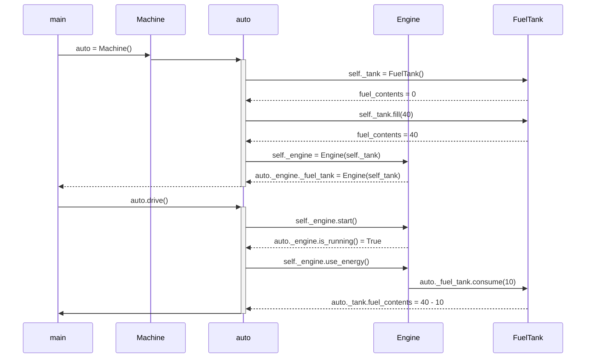

### Tehtävä 3: Sekvenssikaavio

```mermaid
sequenceDiagram

    participant main
    participant Machine
    participant auto
    participant Engine
    participant FuelTank
    main->>Machine: auto = Machine()
    Machine->>+auto: 
    auto->>FuelTank: self._tank = FuelTank()
    FuelTank-->>auto: fuel_contents = 0
    auto->>FuelTank: self._tank.fill(40)
    FuelTank-->>auto: fuel_contents = 40
    auto->>Engine: self._engine = Engine(self._tank)  
    Engine-->>auto: auto._engine._fuel_tank = Engine(self_tank)
    auto-->>-main: 
    main->>+auto: auto.drive()
    auto->>Engine: self._engine.start()
    Engine-->>auto: auto._engine.is_running() = True
    auto->>Engine: self._engine.use_energy()
    Engine->>FuelTank: auto._fuel_tank.consume(10)
    FuelTank-->>auto: auto._tank.fuel_contents = 40 - 10
    auto->>-main: ### Tehtävä 3: Sekvenssikaavio

```
