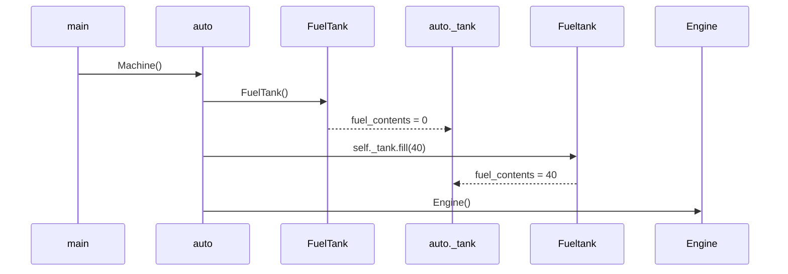

### Tehtävä 3: Sekvenssikaavio

```mermaid
sequenceDiagram

    participant main
    main->>auto: Machine()
    auto->>FuelTank: FuelTank()
    FuelTank-->>auto._tank: fuel_contents = 0
    auto->>Fueltank: self._tank.fill(40)
    Fueltank-->>auto._tank: fuel_contents = 40
    auto->>Engine: Engine()  

```
