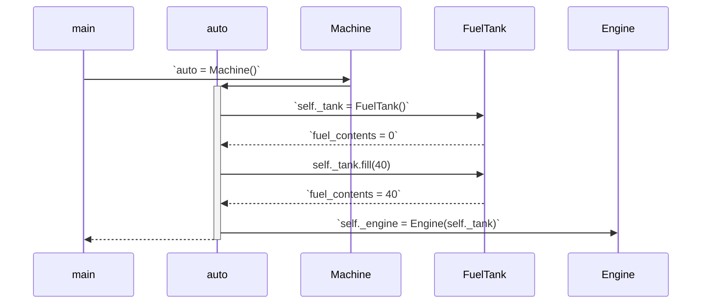

### Tehtävä 3: Sekvenssikaavio

```mermaid
sequenceDiagram

    participant main
    participant auto
    participant Machine
    participant FuelTank
    participant Engine
    main->>Machine: `auto = Machine()`
    Machine->>+auto:
    auto->>FuelTank: `self._tank = FuelTank()`
    FuelTank-->>auto: `fuel_contents = 0`
    auto->>FuelTank: self._tank.fill(40)
    FuelTank-->>auto: `fuel_contents = 40`
    auto->>Engine: `self._engine = Engine(self._tank)`  
    auto-->>-main:

```
